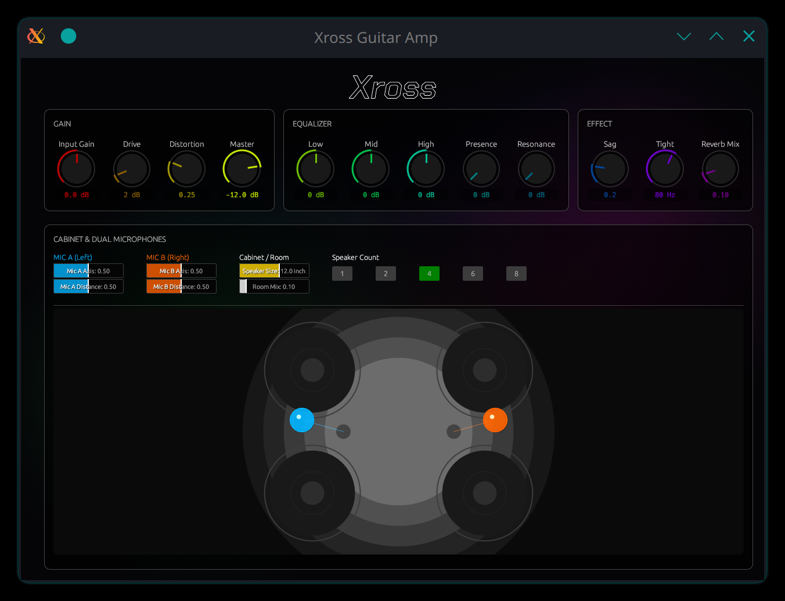

# Xross Guitar Amp



Xross Guitar Amp is a modern, high-gain guitar amplifier plugin built with Rust and the [nih-plug](https://github.com/robbert-vdh/nih-plug) framework. It features a unique distortion engine, physical cabinet modeling with dual-microphone positioning, and a vibrant, interactive GUI.

## Features

### 🎸 Advanced Gain Stage
*   **4x Oversampling:** High-fidelity distortion processing with anti-aliasing filters.
*   **Asymmetric Clipping:** Warm, tube-like saturation combined with aggressive hard-clipping "warp" stages.
*   **Dynamic Response:** Features "Bite" (Slew-rate limiting) and "Punch" (Low-frequency resonance) that react to your playing dynamics.
*   **Metal Scoop:** A dedicated filter to achieve that classic mid-scooped metal tone.

### 🎛️ 5-Band Equalizer
*   **Classic Controls:** Low, Mid, and High shelving/peaking filters.
*   **Presence:** Adds high-end clarity and "air" to the signal.
*   **Resonance:** Controls the low-end thunk and cabinet weight.

### 🔊 Physical Cabinet Modeling
*   **Speaker Customization:** Select speaker sizes from 8" to 15" and configurations from 1 to 8 speakers (1x12, 2x12, 4x12, etc.).
*   **Dual Microphone Setup:** Two independent microphones (Mic A and Mic B) with adjustable **Axis** (center to edge) and **Distance** (close to far).
*   **Room Ambience:** Integrated room simulation with Size and Mix controls for early reflections and depth.

### ✨ Effects & Utility
*   **Sag:** Simulates power supply voltage sag for a compressed, spongy feel.
*   **Tight:** Adjustable Pre-High Pass Filter (20Hz - 500Hz) to clean up low-end flabbiness before distortion.
*   **Reverb:** A built-in diffuse reverb for an instant "in-the-room" sound.

### 🎨 Modern User Interface
*   **Vibrant GUI:** Built with `egui`, featuring smooth animations and a dynamic background.
*   **Interactive Visualizer:** Real-time 2D visualization of the cabinet layout and microphone positions.
*   **High Precision:** All knobs support double-click to reset and direct text input for precise adjustments.

## Plugin Formats
*   **CLAP**
*   **VST3**
*   **Standalone**

## Building from Source

Ensure you have [Rust](https://rustup.rs/) and [Cargo](https://doc.rust-lang.org/cargo/) installed.

```bash
# Clone the repository
git clone https://github.com/The-Infinitys/xross-guitar-amp.git
cd xross-guitar-amp

# Build the plugin (Standalone / VST3 / CLAP)
cargo build --release
```

The resulting binaries will be located in `target/release/`.

## Credits
Developed by **The Infinitys**.

*   Email: [the.infinity.s.infinity@gmail.com](mailto:the.infinity.s.infinity@gmail.com)
*   GitHub: [https://github.com/The-Infinitys/xross-guitar-amp](https://github.com/The-Infinitys/xross-guitar-amp)
